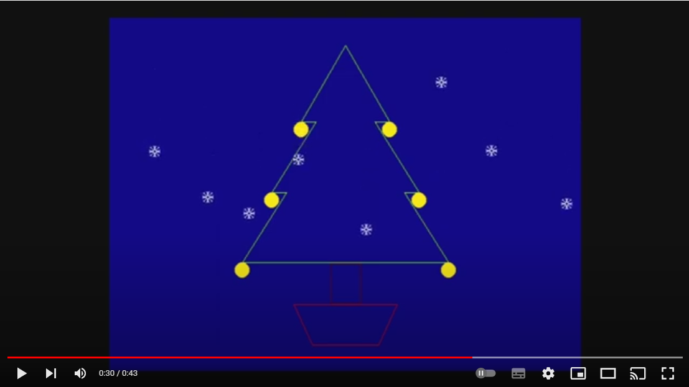

# RC2014 Merry Christmas 2022

Simple demonstration of [Pi Zero Serial Terminal](https://rc2014.co.uk/modules/pi-zero-serial-terminal/) and 
[RC2014-ym2149](https://github.com/electrified/rc2014-ym2149) cards in the [RC2014](https://rc2014.co.uk/), using the 
built in NASCOM BASIC.

The RC2014-YM2149 uses timings for a [ZX True Tone](https://www.tindie.com/products/quazar/zxtt-zx-true-tone-add-on-for-rc2014-ymay/).  It'll play without, but will sound different.

Pi Zero Serial Terminal is running current versions of [PiGfx](https://github.com/fbergama/pigfx) for access to drawing primitives.

If you have the pre-requisite hardware, deploying it should be as simple as pasting the code directly over a serial terminal.

I have not tested it with MBasic.

Demonstrates from BASIC:

* Generating basic musical tones using the AY/YM chip
* Drawing lines and primitives on the screen with PiGfx.
* Bitmap built using [Piskel](https://www.piskelapp.com/), exported to C data and converted to BASIC DATA statements.
* Bitmap loaded and displayed as Sprite with PiGfx.
* Sprites animated in sync with audio.

See a demo below

<iframe width="560" height="315" src="https://www.youtube.com/embed/yxx2xzdkjWg" title="YouTube video player" frameborder="0" allow="accelerometer; autoplay; clipboard-write; encrypted-media; gyroscope; picture-in-picture" allowfullscreen></iframe>

## LICENSE

Copyright 2022 Kian Ryan

Permission is hereby granted, free of charge, to any person obtaining a copy of this software and associated documentation files (the "Software"), to deal in the Software without restriction, including without limitation the rights to use, copy, modify, merge, publish, distribute, sublicense, and/or sell copies of the Software, and to permit persons to whom the Software is furnished to do so, subject to the following conditions:

The above copyright notice and this permission notice shall be included in all copies or substantial portions of the Software.

THE SOFTWARE IS PROVIDED "AS IS", WITHOUT WARRANTY OF ANY KIND, EXPRESS OR IMPLIED, INCLUDING BUT NOT LIMITED TO THE WARRANTIES OF MERCHANTABILITY, FITNESS FOR A PARTICULAR PURPOSE AND NONINFRINGEMENT. IN NO EVENT SHALL THE AUTHORS OR COPYRIGHT HOLDERS BE LIABLE FOR ANY CLAIM, DAMAGES OR OTHER LIABILITY, WHETHER IN AN ACTION OF CONTRACT, TORT OR OTHERWISE, ARISING FROM, OUT OF OR IN CONNECTION WITH THE SOFTWARE OR THE USE OR OTHER DEALINGS IN THE SOFTWARE.

